# Simple Frustration

## 📌 Overview

This project is a simulation of the **Simple Frustration** board game, implemented in Java. The simulation models game mechanics including movement, hitting, winning conditions, and several configurable **variations** and **advanced features** such as different board sizes, undo functionality, and up to four players.

---

## 📚 Table of Contents
1. [Features & Variations](#-features--variations)
2. [Key Classes & Responsibilities](#-key-classes--responsibilities)
3. [Program Execution Flow](#-program-execution-flow)
4. [Design Patterns Used](#-design-patterns-used)
5. [Project Structure](#project-structure)
6. [UML Diagram](#uml-diagram)
7. [Game Outputs](#-game-outputs)
8. [Sample Output (Console)](#-sample-output-console)
9. [Sample Undo Moves (Console)](#-sample-undo-moves-console)
10. [Setup Instructions & Project Requirements](#-setup-instructions--project-requirements)
11. [License](#-license)
---

## 🚀 Features & Variations

### Key Features:
- **Undo Move**: Players can undo their last move and retry their turn if needed.
- **Four Players Support**: Up to four players (Red, Blue, Green, Yellow) are supported, with automatic home and end positions based on the board size.
- **Dice Options**: The game supports both single and double dice rolls for varying gameplay dynamics.

### Variations:
- **End Rule**: A player must land **exactly** on the END position to win. If a player overshoots, they "bounce back" to their last valid position.
- **Hit Rule**: If a player lands on another player’s position, the hit player is sent back to their home.
- **Board Sizes**:
    - **Basic Board** (18 positions, 3 tail positions)
    - **Large Board** (36 positions, 6 tail positions)

---

## 📦 Key Classes & Responsibilities

| Class                      | Responsibility                                                                                                                                                              |
|----------------------------|-----------------------------------------------------------------------------------------------------------------------------------------------------------------------------|
| `Main.java`                | The entry point of the application. This class sets up the board and starts the game.                                                                                       |
| `GameFacade.java`          | Manages the initialization of all required classes based on the selected game variations and settings.                                                                      |
| `GameConfiguration.java`   | Includes the game settings, including board and player variations, as well as the modes.                                                                                    |
| `Player.java`              | Represents a player, including their position on the board, color, and status.                                                                                              |
| `GameBoard.java`           | Contains the core game logic, such as managing the board state, player positions, win conditions, and handling player movements, including undo functionality.              |
| `PlayerManager.java`       | Handles the creation of players using the `PlayerFactory`, initializing them based on board size and count, and stores them in an array list.                               |
| `PlayerFactory.java`       | Implements the **Factory Pattern** to create player objects with specific configurations.                                                                                   |
| `DiceShakManager.java`     | Provides the correct `DiceShaker` interface instance depending on the selected game settings using the **Strategy pattern**.                                                |
| `Commands.java`            | Executes player movements, including advancing positions and undoing moves implementing the `Command Pattern`.                                                              |
| `PositionChangeEvent.java` | Parent Class that displays updates regarding a player's position, such as home, tail, or end positions.                                                                     |
| `Observable.java`          | Implements the **Observer Pattern** by utilizing the `GameBoardObserver` interface to notify observers of game state changes.                                               |
| `IMovementHandler.java`    | An interface that passes movement-related information to specific movement handlers, such as `HandleCollision`, `HandleOverflow`, `HandleOvershoot`, and `HandleUnderflow`. |

## 🔄 Program Execution Flow

### 1. **Initialization**
- The game starts by invoking the `Main.java` class, which serves as the entry point.
- `GameConfiguration.java` is instantiated, where players are prompted to select game settings (board size, player count, variations).
- The settings are passed to `GameFacade.java`, which acts as a **Facade Pattern** to initialize various components such as:
    - `GameBoard.java`: For board setup and management.
    - `PlayerFactory.java`: To be passed into `PlayerManager` and create a player Object.
    - `PlayerManager.java`: For managing players and tracking their positions.
    - `Commands.java`: Handles user inputs for game commands (e.g., move, undo).

### 2. **Game Loop**
- Once initialization is complete, the game enters the main loop, where players take turns.
- During each turn:
    - Players roll dice using a `DiceShaker` instance (either a single or double dice roll, depending on the selected settings).
    - Player movement is processed and validated by the `GameBoard.java` class. The system checks for collisions, overshoots, or underflows.
    - The game state is updated, and events are triggered as necessary (e.g., **CollisionEvent**, **OverflowEvent**).

### 3. **Turn Management**
- Each player's turn is tracked, and they are asked whether they want to undo their last move (if the undo feature is enabled).
- The game checks for win conditions after every move:
    - A player wins if they reach the END position, considering any specific rules such as "End Rule" or "Hit Rule."
    - The board is updated, and the status is displayed (such as player positions and turn count).

### 4. **Event Handling**
- Events such as position changes, collisions, and overflow situations are captured and processed via the `events/` package.
- The `Observable.java` class, using the **Observer Pattern**, notifies relevant components about the changes in the game state.
- Events like **PositionChangeEvent** and **CollisionEvent** are handled by respective classes in the `events/` package to reflect real-time updates on the game state.

### 5. **End Condition**
- The game ends when a player reaches the end position (according to the movement rules).
- The winner is declared, and the game exits, displaying the final status and number of turns taken.

By following this flow, the game ensures smooth execution, correct handling of variations, and a clear end condition.

## 🧠 Design Patterns Used

### **Factory Pattern**
- **Class**: `PlayerFactory.java`
- **Explanation**: The Factory Pattern is used to create player objects with specific configurations. It centralizes the creation logic, making it easier to modify and manage.

### **Strategy Pattern**
- **Class**: `DiceShakerManager.java`
- **Explanation**: The Strategy Pattern allows different dice-rolling strategies (single, double, or fixed) using `DiceShaker` interface. The `DiceShakerManager` handles the strategy selection, enabling flexibility in dice behavior.

#### **Dependency Injection**
- **Class**: `PlayerManager.java`
- **Explanation**: Dependency Injection promotes loose coupling by injecting dependencies (like `PlayerFactory`) into the `PlayerManager`, making the code more flexible and testable.

- **Class**: `Commands.java`
- **Explanation**: Dependencies such as `PlayerManager`, `GameBoard`, and `DiceShaker` are injected, increasing flexibility and making the system easier to modify and test.

- **Class**: `GameBoard.java`
- **Explanation**: Dependencies such as `PlayerManager`, and `DiceShaker` are injected into the class

- **Package**: `movements/`
- **Explanation**: Dependencies such as `PlayerManager`, and `EventManager` are injected into the class

- **Package : `events/`
- **Explanation**: Dependencies such as `Player` are injected to print out that specific player movements.

### **Observer Pattern**
- **Class**: `Observable.java` and `GameBoardObserver.java`
- **Explanation**: The Observer Pattern notifies observers (like `GameBoardObserver`) of game state changes. It decouples event handling from the event source, making the system more flexible.

### **Facade Pattern**
- **Class**: `GameFacade.java`
- **Explanation**: The Facade Pattern simplifies game setup by providing a central interface that hides the complexities of initializing the game, making it easier to interact with.

### **Command Pattern**
- **Class**: `Commands.java`
- **Explanation**: The Command Pattern encapsulates actions (like player movements) as objects. It decouples the invoker from the action, allowing for flexible execution and undoing.


## Project Structure
````
src/
└── com/
    └── simpleFrustration/
        ├── board/  # Contains logic related to the game board
        │   ├── Commands.java    # Game commands for the board
        │   ├── GameBoard.java   # Main game board logic
        │   ├── ICommands.java   # Interface for game commands
        │   └── IGameBoard.java  # Interface for game board functionality
        ├── config/  # Game settings configuration
        │   └── GameConfiguration.java   # Setup and configuration for the game
        ├── dice/  # Dice logic and dice selection
        │   ├── DiceShaker.java          # Dice shaking Interface
        │   ├── DiceShakerManager.java # Choose between different DiceShakers
        │   ├── FixedDiceShaker.java     # Implementation of a fixed dice shaker
        │   ├── IDiceShakerManager.java 
        │   ├── RandomDoubleDiceShaker.java  # Random double dice shaker
        │   └── RandomSingleDiceShaker.java  # Random single dice shakers
        ├── events/  # Event handling during the game
        │   ├── CollisionEvent.java        # Event for collision
        │   ├── EventManager.java          # Manages all events in the game
        │   ├── GameBoardObserver.java    # Interface for observable objects 
        │   ├── HomeEvent.java            # Event related to home position
        │   ├── Observable.java           # Observes game board events
        │   ├── OverflowEvent.java        # Event for overflow situations
        │   ├── OvershootEvent.java       # Event for overshoot situations
        │   ├── PositionChangeEvent.java  # Event for position changes
        │   └── UnderflowEvent.java       # Event for underflow situations
        ├── facade/  # Facade pattern for initializing the game
        │   ├── GameFacade.java   # Game facade to handle game setup and interactions
        │   └── IFacade.java      # Interface for the game facade
        ├── movements/  # Handle different types of movements during the game
        │   ├── HandleCollision.java     # Handles collision scenarios
        │   ├── HandleOverflow.java     # Handles overflow scenarios
        │   ├── HandleOvershoot.java    # Handles overshoot scenarios
        │   ├── HandleUnderflow.java    # Handles underflow scenarios
        │   └── IMovementHandler.java   # Interface for movement handling
        ├── players/  # Player-related configurations and management
        │   ├── Colors.java         # Enum for player colors
        │   ├── IPlayerFactory.java  # Interface for player factory
        │   ├── Player.java         # Player class with attributes and actions
        │   ├── PlayerFactory.java  # Factory for creating players
        │   └── PlayerManager.java  # Manages the players in the game
        └── Main.java   # Entry point to start the game

````
## UML Diagram

```mermaid
 classDiagram
%% Main Class
  class Main {
    +main(String[] args): void
  }

%% Facade and Interfaces
  class IFacade {
    <<interface>>
    +play(numberOfDice: int, numberOfPlayers: int, boardSize: int, disableCollision: boolean, disableOvershoot: boolean, scanner: Scanner): void
  }

  class GameFacade {
    +play(numberOfDice: int, numberOfPlayers: int, boardSize: int, disableCollision: boolean, disableOvershoot: boolean, scanner: Scanner): void
  }

%% Game Configuration
  class GameConfiguration {
    +getNumberOfDice(): int
    +getNumberOfPlayers(): int
    +getBoardSize(): int
    +isDisableCollision(): boolean
    +isDisableOvershoot(): boolean
    -getInput(scanner: Scanner, prompt: String, minValue: int, maxValue: int, defaultValue: int): int
    -getInputBoolean(scanner: Scanner, prompt: String, defaultValue: boolean): boolean
  }

%% Dice Logic
  class IDiceShakerManager {
    <<interface>>
    +createDiceShaker(numberOfDice: int): DiceShaker
  }
  class DiceShakerManager {
    +createDiceShaker(numberOfDice: int): DiceShaker
  }

  class DiceShaker {
    <<interface>>
    +shake(): int
  }

  class FixedDiceShaker {
    +shake(): int
  }

  class RandomSingleDiceShaker {
    +shake(): int
  }

  class RandomDoubleDiceShaker {
    +shake(): int
  }

%% Player 
  class Colors {
    <<enumeration>>
    +Red
    +Blue
    +Green
    +Yellow
  }

  class IPlayerFactory {
    <<interface>>
    +createPlayer(color: Colors, HOME: int, tailDiversion: int, numberOfTailPositions: int, boardSize: int): Player
  }

  class Player {
    -color: Colors
    -HOME: int
    -END: int
    -lastValidPosition: int
    -playerPosition: int
    -tailDiversion: int
    -overflowed: boolean
    -isSpecialCase: boolean
    -numberOfTailPositions: int
    -wasCollision: boolean
    -boardSize: int
    +Player(color: Colors, HOME: int, tailDiversion: int, numberOfTailPositions: int, boardSize: int)
    +getHOME(): int
    +setHOME(HOME: int): void
    +getTailDiversion(): int
    +setTailDiversion(tailDiversion: int): void
    +getColor(): Colors
    +isOverflowed(): boolean
    +setOverflowed(overflowed: boolean): void
    +getNumberOfTailPositions(): int
    +setNumberOfTailPositions(numberOfTailPositions: int): void
    +isSpecialCase(): boolean
    +setSpecialCase(specialCase: boolean): void
    +isWasCollision(): boolean
    +setWasCollision(wasCollision: boolean): void
    +getEND(): int
    +setEND(END: int): void
    +getLastValidPosition(): int
    +setLastValidPosition(lastValidPosition: int): void
    +getPlayerPosition(): int
    +setPlayerPosition(playerPosition: int): void
    +toString(): String
  }

  class PlayerFactory {
    +createPlayer(color: Colors, HOME: int, tailDiversion: int, numberOfTailPositions: int, boardSize: int): Player
  }

  class PlayerManager {
    -playerFactory: PlayerFactory
    -playerList: List<Player>
    -boardSize: int
    -numberOfPlayers: int
    +PlayerManager(boardSize: int, numberOfPlayers: int, playerFactory: PlayerFactory)
    +getPlayerList(): List<Player>
    +addPlayer(player: Player): void
    +removePlayer(player: Player): void
    +initializePlayers(): void
  }

%% Game Board
  class ICommands {
    <<interface>>
    +execute(): void
    +undo(): void
  }

  class Commands {
    -board: GameBoard
    -shaker: DiceShaker
    -scanner: Scanner
    -playerManager: PlayerManager
    -currentPlayer: Player
    -advance: int
    +Commands(board: GameBoard, shaker: DiceShaker, playerManager: PlayerManager, scanner: Scanner)
    +execute(): void
    +undo(): void
  }

  class GameBoard {
    -gameWon: boolean
    -moves: int
    -totalMoves: int
    -BOARD_SIZE: int
    -disableBounceEvent: boolean
    -eventManager: EventManager
    -bounceDetector: IMovementHandler
    -handleUnderflow: IMovementHandler
    -handleOverflow: IMovementHandler
    +GameBoard(BOARD_SIZE: int, disableHitEvent: boolean, disableBounceEvent: boolean, playerManager: PlayerManager)
    +isGameWon(): boolean
    +advancePlayer(player: Player, advance: int): void
    +undoPlayerPosition(player: Player, advance: int): void
  }

%%Movements 
  class IMovementHandler {
    <<interface>>
    +movementHandler(player: Player, advance: int, originalIndex: int, newIndex: int, moves: int): void
  }

  class HandleCollision {
    -playerManager: PlayerManager
    -disableHitEvent: boolean
    -eventManager: EventManager
    +HandleCollision(playerManager: PlayerManager, disableHitEvent: boolean, eventManager: EventManager)
    +movementHandler(player: Player, advance: int, currentPosition: int, candidateIndex: int, moves: int): void
    -resolveCollision(otherPlayer: Player, player: Player, candidateIndex: int, advance: int, currentPosition: int, moves: int): void
  }

  class HandleOverflow {
    -collisionDetector: IMovementHandler
    -eventManager: EventManager
    -BOARD_SIZE: int
    +HandleOverflow(collisionDetector: IMovementHandler, eventManager: EventManager, BOARD_SIZE: int)
    +movementHandler(player: Player, advance: int, originalIndex: int, candidateIndex: int, moves: int): void
  }

  class HandleOvershoot {
    -collisionDetector: IMovementHandler
    -eventManager: EventManager
    +HandleOvershoot(collisionDetector: IMovementHandler, eventManager: EventManager)
    +movementHandler(player: Player, advance: int, currentPosition: int, candidateIndex: int, moves: int): void
    -resolveBounce(player: Player, advance: int, currentPosition: int, newIndex: int, moves: int): void
  }

  class HandleUnderflow {
    -collisionDetector: IMovementHandler
    -eventManager: EventManager
    +HandleUnderflow(collisionDetector: IMovementHandler, eventManager: EventManager)
    +movementHandler(player: Player, advance: int, originalIndex: int, newIndex: int, moves: int): void
  }

%% Event Handling
  class PositionChangeEvent {
    -oldPosition: int
    -newPosition: int
    -advance: int
    -moves: int
    -totalMoves: int
    -player: Player
    +PositionChangeEvent(player: Player, moves: int, advance: int, oldPosition: int, newPosition: int)
    +PositionChangeEvent(player: Player, moves: int, advance: int, oldPosition: int, newPosition: int, totalMoves: int)
    +getOldPosition(): int
    +getNewPosition(): int
    +getAdvance(): int
    +getMoves(): int
    +getTotalMoves(): int
    +getPlayer(): Player
    +toString(): String
  }

  class CollisionEvent {
    -hitPlayer: Player
    -hitPlayerOldPosition: int
    +CollisionEvent(player: Player, play: int, advance: int, oldPosition: int, newPosition: int, hitPlayer: Player, hitPlayerOldPosition: int)
    +toString(): String
  }

  class OverflowEvent {
    +OverflowEvent(player: Player, play: int, advance: int, oldPosition: int, newPosition: int)
    +toString(): String
  }

  class HomeEvent {
    +HomeEvent(player: Player, play: int, advance: int, oldPosition: int, newPosition: int, totalMoves: int)
    +toString(): String
  }

  class OvershootEvent {
    +OvershootEvent(player: Player, play: int, advance: int, oldPosition: int, newPosition: int)
    +toString(): String
  }

  class UnderflowEvent {
    +UnderflowEvent(player: Player, play: int, advance: int, oldPosition: int, newPosition: int)
    +toString(): String
  }

  class EventManager {
    -observers: List<GameBoardObserver>
    +EventManager()
    +add(observer: GameBoardObserver)
    +detach(observer: GameBoardObserver)
    +onOverflow(player: Player, advance: int, originalIndex: int, newIndex: int, moves: int)
    +onUnderflow(player: Player, advance: int, originalIndex: int, newIndex: int, moves: int)
    +onHomeEvent(player: Player, advance: int, currentPosition: int, candidateIndex: int, moves: int, totalMoves: int)
    +onOvershoot(player: Player, advance: int, currentPosition: int, newIndex: int, moves: int)
    +onCollision(player: Player, advance: int, currentPosition: int, candidateIndex: int, moves: int, hitPlayer: Player, hitPlayerOldPosition: int)
    +notifyObservers(action: Consumer<GameBoardObserver>)
  }

  class Observable {
    +onEvent(overflowEvent: OverflowEvent): void
    +onEvent(underflowEvent: UnderflowEvent): void
    +onEvent(homeEvent: HomeEvent): void
    +onEvent(onOvershootEvent: OvershootEvent): void
    +onEvent(onCollisionEvent: CollisionEvent): void
  }

  class GameBoardObserver {
    +onEvent(overflowEvent: OverflowEvent): void
    +onEvent(underflowEvent: UnderflowEvent): void
    +onEvent(homeEvent: HomeEvent): void
    +onEvent(onOvershootEvent: OvershootEvent): void
    +onEvent(onCollisionEvent: CollisionEvent): void
  }

  Main --> GameConfiguration : creates
  Main --> GameFacade : creates

  GameFacade --> IFacade : uses
  GameFacade --> GameConfiguration : uses
  GameFacade --> DiceShakerManager : creates
  GameFacade --> PlayerManager : creates
  GameFacade --> GameBoard : creates
  GameFacade --> Commands : creates

  DiceShakerManager --> IDiceShakerManager
  DiceShakerManager --> RandomSingleDiceShaker : creates
  DiceShakerManager --> RandomDoubleDiceShaker : creates
  DiceShakerManager --> FixedDiceShaker : creates

  RandomSingleDiceShaker --> DiceShaker : uses
  RandomDoubleDiceShaker --> DiceShaker : uses
  FixedDiceShaker --> DiceShaker : uses

  PlayerManager --> PlayerFactory : creates
  PlayerFactory --> Player : creates
  PlayerManager --> Player : uses

  GameBoard --> EventManager : creates
  GameBoard --> HandleCollision : creates
  GameBoard --> HandleOvershoot : creates
  GameBoard --> HandleUnderflow : creates
  GameBoard --> HandleOverflow : creates

  GameBoard --> HandleCollision : uses
  GameBoard --> HandleOvershoot : uses
  GameBoard --> HandleUnderflow : uses
  GameBoard --> HandleOverflow : uses

  HandleCollision --> EventManager : uses
  HandleOvershoot --> EventManager : uses
  HandleUnderflow --> EventManager : uses
  HandleOverflow --> EventManager : uses

  EventManager --> Observable : creates
  EventManager --> Observable : uses
  Observable --> GameBoardObserver : uses

  EventManager --> CollisionEvent : creates
  EventManager --> HomeEvent : creates
  EventManager --> OverflowEvent : creates
  EventManager --> OvershootEvent : creates
  EventManager --> UnderflowEvent : creates

  CollisionEvent --> PositionChangeEvent : uses
  HomeEvent --> PositionChangeEvent : uses
  OverflowEvent --> PositionChangeEvent : uses
  OvershootEvent --> PositionChangeEvent : uses
  UnderflowEvent --> PositionChangeEvent : uses

  Commands --> GameBoard : uses
  Commands --> PlayerManager : uses
  Commands --> DiceShaker : uses


```


## 📊 Game Outputs

During gameplay, the following information is printed:
- Current Player
- Turns
- Game.Dice value
- Start and end position of the move
- Undo prompt and confirmation if selected
- Game winner, turns the player took and total turn count at end
---

## 📈 Sample Output (Console)

```text
Red play 5 rolls 2
Red moves from HOME Position 1 to Position 3
Do you want to undo your move? (yes/no)

Blue play 5 rolls 2
Blue moves from Position 28 to Position 30
Do you want to undo your move? (yes/no)

Green Wraps around the board
Green play 5 rolls 12
Green moves from Position 25 to Position 1
Do you want to undo your move? (yes/no)

Yellow play 5 rolls 3
Yellow moves from TAIL Position 3 to END
Yellow wins in 5 moves
Total plays 20
````

## 🔄 Sample Undo Moves (Console)

```text
Red play 1 rolls 12
Red moves from HOME Position 1 to Position 13
Do you want to undo your move? (yes/no)
yes
Red's move has been undone.
Red play 1 rolls 5
Red moves from HOME Position 1 to Position 6
Do you want to undo your move? (yes/no)

Blue play 1 rolls 2
Blue moves from HOME Position 10 to Position 12
Do you want to undo your move? (yes/no)
yes
Blue's move has been undone.
Blue play 1 rolls 12
Blue moves from HOME Position 10 to Position 22
Do you want to undo your move? (yes/no)
```

## ⚙️ Setup Instructions & Project Requirements

To run this project locally, make sure your development environment is properly configured.

### ✅ Requirements

- **Java Development Kit (JDK)**: Version 17 or later
- **IDE**: IntelliJ IDEA (recommended) or any Java-compatible IDE
- **Build Tool**: None required (basic project), or [Gradle/Maven] if your project uses dependencies
- **Git**: To clone the repository (optional, if pulling from version control)

### 🚀 Running the Program
- **Clone the repository** (if using Git):
  ```bash
  git clone https://github.com/adss0/SimpleFrustration
  ```
- Open the project in IntelliJ IDEA or your preferred IDE.
- Locate the Main class, right-click and choose Run 'Main'.

## 📝 License

This project is licensed under the MIT License.
