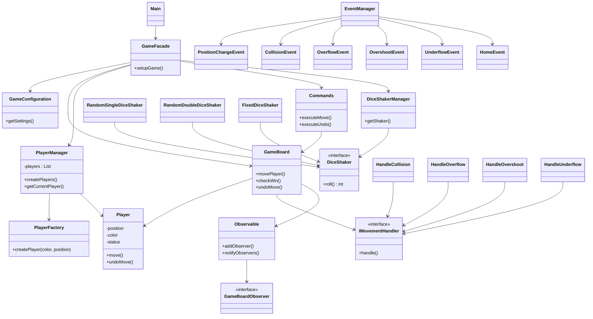

# Simple Frustration

## 📌 Overview

This project is a simulation of the **Simple Frustration** board game, implemented in Java. The simulation models game mechanics including movement, hitting, winning conditions, and several configurable **variations** and **advanced features** such as different board sizes, undo functionality, and up to four players.

---

## 📚 Table of Contents
1. [Key Classes & Responsibilities](#key-classes--responsibilities)
2. [Program Execution Flow](#program-execution-flow)
3. [Advanced Features & Variations](#advanced-features--variations)
4. [Design Patterns](#design-patterns)
5. [UML Diagrams](#uml-diagrams)

---

## 🚀 Features & Variations

### Key Features:
- **Undo Move**: Players can undo their last move and retry their turn if needed. This feature helps test different strategies and correct mistakes.
- **Four Players Support**: Up to four players (Red, Blue, Green, Yellow) are supported, with automatic home and end positions based on the board size.
- **Dice Options**: The game supports both single and double dice rolls for varying gameplay dynamics.

### Variations:
- **End Rule**: A player must land **exactly** on the END position to win. If a player overshoots, they "bounce back" to their last valid position.
- **Hit Rule**: If a player lands on another player’s position, the hit player is sent back to their home.
- **Board Sizes**:
    - **Basic Board** (18 positions, 3 tail positions)
    - **Large Board** (36 positions, 6 tail positions)

---

## 📦 Key Classes & Responsibilities

| Class                      | Responsibility                                                                                                                                                              |
|----------------------------|-----------------------------------------------------------------------------------------------------------------------------------------------------------------------------|
| `Main.java`                | The entry point of the application. This class sets up the board and starts the game.                                                                                       |
| `GameFacade.java`          | Manages the initialization of all required classes based on the selected game variations and settings.                                                                      |
| `GameConfiguration.java`   | Prompts the player to select game settings, including board and player variations, as well as the modes.                                                                    |
| `Player.java`              | Represents a player, including their position on the board, color, and status.                                                                                              |
| `GameBoard.java`           | Contains the core game logic, such as managing the board state, player positions, win conditions, and handling player movements, including undo functionality.              |
| `PlayerManager.java`       | Handles the creation of players using the `PlayerFactory`, initializing them based on board size and count, and stores them in an array list.                               |
| `PlayerFactory.java`       | Implements the **Factory Pattern** to create player objects with specific configurations.                                                                                   |
| `DiceShaker.java`          | An interface for shaking dice, allowing for different strategies, such as single or double dice rolls, using the **Strategy Pattern**.                                      |
| `DiceShakManager.java`     | Provides the correct `DiceShaker` instance depending on the selected game settings.                                                                                         |
| `Commands.java`            | Executes player movements, including advancing positions and undoing moves.                                                                                                 |
| `PositionChangeEvent.java` | Handles and displays updates regarding a player's position, such as home, tail, or end positions.                                                                           |
| `Observable.java`          | Implements the **Observer Pattern** by utilizing the `GameBoardObserver` interface to notify observers of game state changes.                                               |
| `IMovementHandler.java`    | An interface that passes movement-related information to specific movement handlers, such as `HandleCollision`, `HandleOverflow`, `HandleOvershoot`, and `HandleUnderflow`. |

## 🔄 Program Execution Flow

### 1. **Initialization**
- The game starts by invoking the `Main.java` class, which serves as the entry point.
- `GameConfiguration.java` is instantiated, where players are prompted to select game settings (board size, player count, variations).
- The settings are passed to `GameFacade.java`, which acts as a **Facade Pattern** to initialize various components such as:
    - `GameBoard.java`: For board setup and management.
    - `PlayerFactory.java`: To be passed into `PlayerManager` and create a player Object.
    - `PlayerManager.java`: For managing players and tracking their positions.
    - `Commands.java`: Handles user inputs for game commands (e.g., move, undo).

### 2. **Game Loop**
- Once initialization is complete, the game enters the main loop, where players take turns.
- During each turn:
    - Players roll dice using a `DiceShaker` instance (either a single or double dice roll, depending on the selected settings).
    - Player movement is processed and validated by the `GameBoard.java` class. The system checks for collisions, overshoots, or underflows.
    - The game state is updated, and events are triggered as necessary (e.g., **CollisionEvent**, **OverflowEvent**).

### 3. **Turn Management**
- Each player's turn is tracked, and they are asked whether they want to undo their last move (if the undo feature is enabled).
- The game checks for win conditions after every move:
    - A player wins if they reach the END position, considering any specific rules such as "End Rule" or "Hit Rule."
    - The board is updated, and the status is displayed (such as player positions and turn count).

### 4. **Event Handling**
- Events such as position changes, collisions, and overflow situations are captured and processed via the `events/` package.
- The `Observable.java` class, using the **Observer Pattern**, notifies relevant components about the changes in the game state.
- Events like **PositionChangeEvent** and **CollisionEvent** are handled by respective classes in the `events/` package to reflect real-time updates on the game state.

### 5. **End Condition**
- The game ends when a player reaches the end position (according to the movement rules).
- The winner is declared, and the game exits, displaying the final status and number of turns taken.

By following this flow, the game ensures smooth execution, correct handling of variations, and a clear end condition.

## 🧠 Design Patterns Used

| Pattern                  | Usage                                                                                                                                                                                                                            |
|--------------------------|----------------------------------------------------------------------------------------------------------------------------------------------------------------------------------------------------------------------------------|
| **Factory Pattern**      | - **`PlayerFactory.java`**: Creates player objects with specific configurations.                                                                                                                                                 |
| **Strategy Pattern**     | - **`DiceShakerManager.java`**: Allows for different dice rolling strategies (single or double dice). <br> - **`IMovementHandler.java`**: Switches between different movement strategies such as overflow or collision handling. |
| **Observer Pattern**     | - **`Observable.java`**: Implements the observer pattern by notifying observers (e.g., game board state changes).                                                                                                                |
| **Facade Pattern**       | - **`GameFacade.java`**: Simplifies the game initialization process, providing a central interface for setting up the game.                                                                                                      |
| **Command Pattern**      | - **`Commands.java`**: Encapsulates player movements (e.g., advance, undo) as command objects for flexible execution.                                                                                                            |
| **Dependency Injection** | - **`PlayerManager.java`**: The `PlayerFactory` is injected into the constructor, promoting loose coupling and increasing flexibility and testability.                                                                           |

## Project Structure
````
src/
└── com/
    └── simpleFrustration/
        ├── board/  # Contains logic related to the game board
        │   ├── Commands.java    # Game commands for the board
        │   ├── GameBoard.java   # Main game board logic
        │   ├── ICommands.java   # Interface for game commands
        │   └── IGameBoard.java  # Interface for game board functionality
        ├── config/  # Game settings configuration
        │   └── GameConfiguration.java   # Setup and configuration for the game
        ├── dice/  # Dice logic and dice selection
        │   ├── DiceShaker.java          # Dice shaking Interface
        │   ├── DiceShakerManager.java # Choose between different DiceShakers
        │   ├── FixedDiceShaker.java     # Implementation of a fixed dice shaker
        │   ├── IDiceShakerManager.java 
        │   ├── FixedDiceShakerFactory.java  # Factory for fixed dice shakers
        │   ├── RandomDoubleDiceShaker.java  # Random double dice shaker
        │   └── RandomSingleDiceShaker.java  # Random single dice shakers
        ├── events/  # Event handling during the game
        │   ├── CollisionEvent.java        # Event for collision
        │   ├── EventManager.java          # Manages all events in the game
        │   ├── GameBoardObserver.java    # Interface for observable objects 
        │   ├── HomeEvent.java            # Event related to home position
        │   ├── Observable.java           # Observes game board events
        │   ├── OverflowEvent.java        # Event for overflow situations
        │   ├── OvershootEvent.java       # Event for overshoot situations
        │   ├── PositionChangeEvent.java  # Event for position changes
        │   └── UnderflowEvent.java       # Event for underflow situations
        ├── facade/  # Facade pattern for initializing the game
        │   ├── GameFacade.java   # Game facade to handle game setup and interactions
        │   └── IFacade.java      # Interface for the game facade
        ├── movements/  # Handle different types of movements during the game
        │   ├── HandleCollision.java     # Handles collision scenarios
        │   ├── HandleOverflow.java     # Handles overflow scenarios
        │   ├── HandleOvershoot.java    # Handles overshoot scenarios
        │   ├── HandleUnderflow.java    # Handles underflow scenarios
        │   └── IMovementHandler.java   # Interface for movement handling
        ├── players/  # Player-related configurations and management
        │   ├── Colors.java         # Enum for player colors
        │   ├── IPlayerFactory.java  # Interface for player factory
        │   ├── Player.java         # Player class with attributes and actions
        │   ├── PlayerFactory.java  # Factory for creating players
        │   └── PlayerManager.java  # Manages the players in the game
        └── Main.java   # Entry point to start the game

````
## UML Diagram


## 📊 Game Outputs

During gameplay, the following information is printed:
- Current Player
- Game.Dice value
- Start and end position of the move
- Player's running turn count
- Undo prompt and confirmation if selected
- Game winner and total turn count at end

---

## 📌 Home Positions by Game.Board Type

### 🟩 Basic Game.Board (18 Game.com.simpleFrustration.Main Positions, 3 Tail)
- Red: 1
- Blue: 10
- Green: 5
- Yellow: 14

### 🟥 Large Game.Board (36 Game.com.simpleFrustration.Main Positions, 6 Tail)
- Red: 1
- Blue: 19
- Green: 10
- Yellow: 28

These are dynamically assigned based on board size and number of players.

---

## 📈 Sample Output (Console)

```text
Red rolled a 6: Moved from 1 to 7
Red has taken 1 turns.
Do you want to undo your move? (yes/no)
...
Yellow rolled a 2: Moved from 28 to 30
...
🏆 Game Over! Red wins!
Total turns taken by all players: 42
